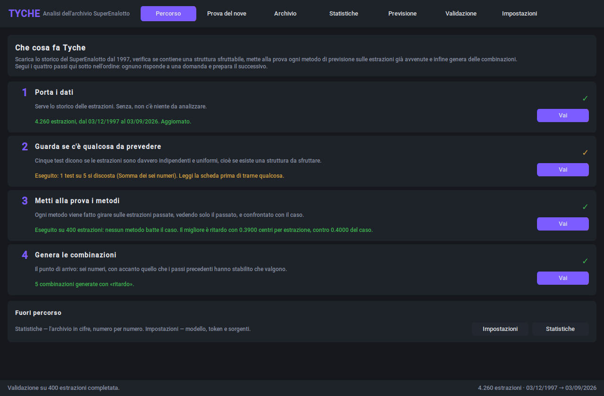
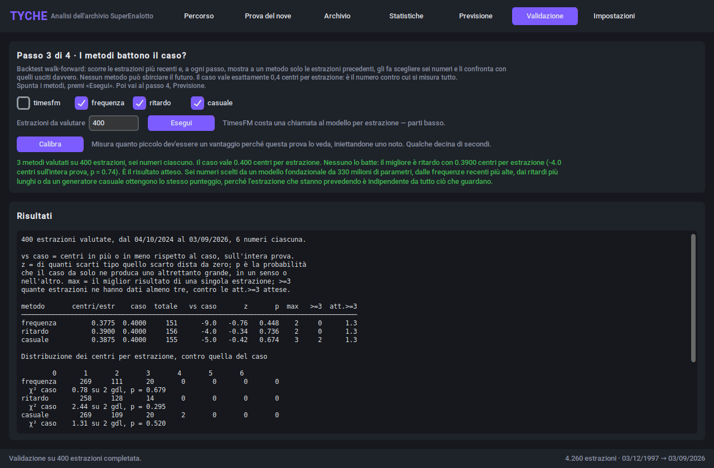
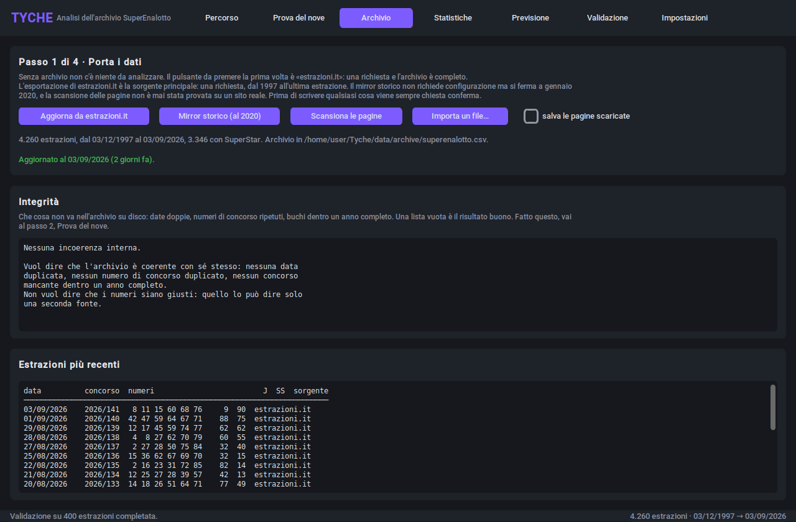

# Tyche

**Analisi dell'archivio SuperEnalotto e previsioni con TimesFM 3.0.**

Un'applicazione desktop che scarica lo storico completo delle estrazioni del
SuperEnalotto dal dicembre 1997, lo sottopone a test per cercarvi struttura
sfruttabile, lo consegna al modello fondazionale per serie temporali TimesFM
3.0 di Google, e misura — onestamente — quanto valgano le previsioni che ne
escono.

La versione breve di quella misura: **niente**. Le estrazioni sono
indipendenti, i test lo dicono, e ogni metodo del programma ottiene 0,4 centri
su sei, che è esattamente il caso. Tyche è costruito per dimostrarlo con cura,
non per affermarlo.

---



*La scheda Percorso, che è quella su cui il programma si apre: quattro passi
dall'archivio vuoto alle sei cifre, ognuno con accanto quello che ha prodotto.*

---

## Che cosa fa

Il programma si apre sulla scheda **Percorso**, che è una mappa: quattro passi
nell'ordine in cui vanno fatti, ognuno con la domanda a cui risponde e con
quello che ha prodotto finora. Nessun passo fa lavoro suo — ognuno apre la
scheda che lo fa.

| | Passo | La domanda a cui risponde |
|---|---|---|
| 1 | **Archivio** | Ci sono i dati? Scarica, importa e ispeziona lo storico, e dice che cosa non va. |
| 2 | **Prova del nove** | C'è qualcosa da prevedere? Cinque test dell'ipotesi che le estrazioni siano indipendenti e uniformi. |
| 3 | **Validazione** | I metodi battono il caso? Backtest walk-forward, senza che nessuno possa sbirciare il futuro. |
| 4 | **Previsione** | Il punto di arrivo: sei numeri, da TimesFM 3.0 o da tre metodi di riferimento, quello casuale incluso. |

Fuori percorso ci sono **Statistiche** — frequenze, ritardi, decine e coppie,
ogni tabella con accanto il valore che produrrebbe il caso — e
**Impostazioni**, con checkpoint, dispositivo, token e indirizzi delle
sorgenti.

L'ordine dei passi è l'argomento del programma. Il passo 2 dice che le
estrazioni sono indipendenti, il passo 3 che nessun metodo batte il caso, e il
passo 4 consegna comunque sei numeri — perché è quello a cui serve. Chi
percorre la strada arriva alle combinazioni avendo già letto quanto valgono,
che è un posto migliore per dirlo di una scheda che si può non aprire mai.



*La scheda Validazione. Tre metodi, 400 estrazioni, il caso vale 0,4000 — e le
palline viola della scheda Previsione hanno lo stesso aspetto sicuro
qualunque metodo le abbia prodotte.*

C'è anche una riga di comando, per le parti che vale la pena automatizzare:

```
python main.py --check                  # i cinque test di indipendenza
python main.py --validate 500           # backtest walk-forward
python main.py --power                  # quanto piccolo un vantaggio deve essere
python main.py --update                 # aggiorna da estrazioni.it — prova a vuoto
python main.py --update --yes           # ...e scrive
python main.py --import FILE --yes      # importa un file scaricato a mano
python main.py --forecast timesfm       # sei numeri
python main.py --export-sqlite data/tyche.db
```

`--update` e `--import` mostrano che cosa cambierebbero e non scrivono nulla
senza `--yes`, e rifiutano `--yes` quando l'import contraddice un'estrazione
già registrata. L'archivio non ha un annulla e una delle due sorgenti di rete
non è mai stata verificata: un lavoro pianificato che scrive tutto quello che
ha analizzato è l'unica forma di questa funzione capace di distruggere lo
storico in silenzio.

---

## Installazione

```
pip install torch --index-url https://download.pytorch.org/whl/cpu
pip install -r requirements.txt
python main.py
```

Su Debian o Ubuntu `tkinter` è un pacchetto di sistema separato e deve
corrispondere all'interprete con cui esegui Tyche:

```
sudo apt install python3-tk
```

La prima previsione con TimesFM scarica circa 1,3 GB di pesi da Hugging Face.
Tutto il resto funziona senza.

Per Windows c'è un pacchetto pronto allegato a ogni release: si scompatta in
una sola cartella e si avvia con `start.cmd`, senza installare Python.

---

## Da dove vengono i dati

Quattro sorgenti, elencate per quanto meritano fiducia:

- **estrazioni.it** — tutto l'archivio in una richiesta: **4.260 estrazioni dal
  3 dicembre 1997 all'ultima**, intestazione etichettata, zero problemi di
  integrità. È da qui che viene l'archivio di Tyche ed è la prima cosa che
  `--update` prova. Il suo indirizzo di download è dedotto e non documentato,
  quindi la CI lo ricontrolla e l'import viene sempre confermato prima di
  scrivere.
- **Import manuale** — qualunque CSV, TXT o TSV scaricato a mano, compresa
  quella stessa esportazione. Il lettore riconosce il formato di Tyche,
  qualunque file con un'intestazione etichettata, il formato in blocco a dodici
  colonne e, come ultima risorsa, qualunque file con una data seguita da sei
  numeri per riga. Non può rompersi e non richiede rete.
- **Mirror storico** — una richiesta, tutto lo storico, senza intestazione.
  Utile per partire, e **si ferma a gennaio 2020**: la sua stessa risposta HTTP
  dice `last-modified: 24 Jan 2020`. È anche sbagliato in alcuni punti — vedi
  sotto.
- **Scansione per anno** — la sorgente che terrebbe aggiornato l'archivio senza
  scaricare a mano. I suoi indirizzi erano quattro tentativi fatti da un
  ambiente che non riusciva a raggiungere nessuno dei siti, e tutti e quattro
  hanno mancato. Uno è stato corretto sulla base di prove; gli altri restano
  tentativi. Controlla che cosa importa.

La scheda Archivio mostra un **rapporto di integrità** accanto all'elenco delle
estrazioni, perché il mirror storico è sbagliato in un modo che nessun
controllo riga per riga può vedere: le prime nove estrazioni del 1999 sono
etichettate 1998, il che produce nove numeri di concorso duplicati e due coppie
di estrazioni diverse che condividono una data. Tyche lo rileva e lo ripara
all'import, sulla base di prove e non di un elenco scritto a mano — vedi
`core/archive.py::repair_year_offset`.

Due conseguenze dell'avere una sorgente affidabile ma manuale e una automatica
ma non verificata:

- **Gli import sono supervisionati.** Prima di scrivere qualsiasi cosa, Tyche
  simula l'unione e mostra che cosa cambierebbe: righe aggiunte, righe che
  *contraddicono* un'estrazione registrata, e ogni errore di integrità che
  l'unione introdurrebbe. Un import pulito da una sorgente affidabile passa
  senza chiedere; tutto ciò che arriva da un indirizzo dedotto viene sempre
  confermato, perché un errore di analisi dall'aria sicura è esattamente quello
  che produce un lettore non verificato. C'è anche un interruttore per salvare
  le pagine scaricate: un parser non si corregge dalla descrizione di che cosa
  è andato storto, ma solo dalla pagina che è andata storta.
- **L'obsolescenza è sullo schermo, non nella documentazione.** Il piè di
  pagina e la scheda Archivio dicono di quante estrazioni l'archivio è
  indietro, misurate sulla cadenza dell'archivio stesso e non su un calendario
  scritto nel codice.



---

## Che cosa hanno trovato i test

Su **4.260 estrazioni, dal 3 dicembre 1997 al 3 settembre 2026**.

| Test | Esito |
|---|---|
| Uniformità dei 90 numeri | χ² = 94,3 su 89 gdl, p = 0,33 — nessuno sbilanciamento |
| Distribuzione dei ritardi | χ² = 45,7 su 50 gdl, p = 0,64 — i ritardi sono geometrici, nessun numero è mai «dovuto» |
| Indipendenza seriale, t → t+1 | χ² = 0,95, p = 0,33 — l'ultima estrazione non dice nulla |
| Ripetizioni fra estrazioni consecutive | χ² = 2,10 su 3 gdl, p = 0,55 — sovrapposizione media 0,391 contro 0,400 attesa |
| Somma dei sei numeri | z = +3,73, **p = 0,0002** — vedi sotto |

Quattro test su cinque danno esattamente quello che produce un gioco equo. Il
quinto no, ed è l'unico risultato reale qui — ma non quello che sembrava
all'inizio.

**La somma media dei sei numeri è 276,5 contro una attesa di 273,0.** Era stata
misurata la prima volta su un archivio diverso, e la spiegazione ovvia era che
quel file fosse sbagliato. Non lo è: l'effetto si riproduce su una seconda
fonte indipendente. Quello che fa, invece, è *svanire*.

| Periodo | Estrazioni | Somma media |
|---|---|---|
| 1997–1999 | 217 | 282,3 |
| Anni 2000 | 1.287 | 278,5 |
| Anni 2010 | 1.565 | 276,2 |
| Anni 2020 | 1.191 | **273,8** |

Attesa: 273,0. Sulle ultime 1.191 estrazioni il test non trova più nulla —
z = +0,42, e la correlazione fra un numero e quante volte è stato estratto
scende da +0,37 sull'intero archivio a +0,05. Qualcosa spingeva l'estrazione
verso i numeri alti, si è indebolito costantemente per venticinque anni, e da
sei anni non c'è più niente da vedere. Che è grosso modo la forma che ci si
aspetterebbe se fosse mai stato un fenomeno fisico.

Due cose che **non** è. Non è un motivo per giocare i numeri alti: lo
sbilanciamento è sparito, e persino al suo massimo valeva meno del 2% per
numero contro un montepremi che trattiene una quota fissa di ogni euro
giocato. E non è un risultato acquisito: è una statistica su due fonti che
potrebbero avere un antenato comune.

Il backtest walk-forward risolve la questione pratica. Ultime 1.000
estrazioni, sei numeri per volta:

| Metodo | Centri per estrazione | Rispetto al caso | p |
|---|---|---|---|
| casuale | 0,3790 | −21,0 | 0,26 |
| frequenza | 0,3930 | −7,0 | 0,71 |
| ritardo | 0,3900 | −10,0 | 0,59 |

Il caso vale 0,4000. Nessuno lo batte, modello da 330 milioni di parametri
compreso.

---

## «Non abbiamo trovato niente» oppure «non avremmo potuto trovarlo»

Sono due frasi diverse e producono lo stesso tabellone. Un esperimento che non
trova nulla vale qualcosa solo se sappiamo che cosa sarebbe riuscito a
trovare, quindi Tyche lo misura invece di lasciarlo intendere.

`python main.py --power` — oppure il pulsante **Calibra** nella scheda
Validazione — rifà la stessa prova contro previsori il cui vantaggio è noto,
perché ce l'ha messo il programma. Ognuno legge di nascosto l'estrazione che
gli si chiede di prevedere e ne rivela una parte, in una quantità che si può
girare come una manopola: a zero è la linea di base casuale, alzandola diventa
un oracolo. La frazione di ripetizioni in cui la validazione se ne accorge è
la sua sensibilità.

Le forme del vantaggio sono tre, perché è la forma a decidere la risposta:

| forma | che cosa fa | vista dai centri | vista dal rango |
|---|---|---|---|
| `concentrato` | rivela i sei numeri di netto, in cima | da 0,020 | mai all'80% |
| `diffuso` | li fa salire di qualche posto | da 0,020 | da 0,020 |
| `nascosto` | li fa salire, ma mai oltre la metà | **mai** | da 0,050 |

La riga che conta è l'ultima. **Il conteggio dei centri guarda solo i primi
sei numeri di una graduatoria di novanta**, quindi un vantaggio che esiste e
non arriva fin lassù è invisibile per costruzione: il suo z resta lo stesso
identico numero a ogni dimensione. La statistica sul rango medio lo vede a
z = +11 sulle stesse prove.

Non è che il rango sia una misura migliore — sulla forma `concentrato` è
nettamente peggiore. Sono due letture della stessa prova, cieche in punti
diversi, e Tyche stampa entrambe.

La riga a dimensione zero è il controllo: non contiene alcun vantaggio, e
segnala qualcosa nel 4% e nel 5% dei casi contro il 5% nominale. Se non fosse
così, nessun'altra riga della stessa colonna vorrebbe dire niente.

E anche questa misura ha un limite dichiarato: tre forme non sono tutte le
forme, quindi le soglie qui sopra sono il caso migliore. Un vantaggio reale di
forma diversa sarebbe più difficile da vedere, non più facile.

---

## Le probabilità, che nessun metodo cambia

Combinatoria esatta su una ruota da 90 numeri, sei estratti:

| Categoria | Una su |
|---|---|
| 6 | 622.614.630 |
| 5+1 | 103.769.105 |
| 5 | 1.250.230 |
| 4 | 11.907 |
| 3 | 327 |

Valgono qualunque numero si giochi. I premi sono a totalizzatore — una quota
della raccolta, non un importo fisso — quindi il concessionario trattiene una
parte fissa e il rendimento atteso di una colonna è sempre inferiore al suo
prezzo.

---

## Interrogare l'archivio

L'archivio è un CSV perché con 4.260 righe è la risposta giusta: 238 KB, 80 ms
per caricarlo, e si può cercare con grep, confrontare dentro un commit e aprire
in un foglio di calcolo. SQLite lo legge in 7 ms, undici volte più veloce, il
che significa 73 millisecondi risparmiati una volta all'avvio per un file un
terzo più grande — per confronto, costruire le matrici delle caratteristiche
costa 63 ms.

Quindi a SQL tocca un'esportazione, non lo strato di memorizzazione:

```
python main.py --export-sqlite data/tyche.db
```

Tre tabelle: `draws` (una riga per estrazione, con la somma già calcolata),
`picks` (una riga per numero per estrazione, indicizzata — è questa a rendere
«quante volte è uscito il 37 nel 2024» un `GROUP BY`) e `number_stats` (la
tabella delle frequenze, con accanto a ogni conteggio la sua attesa). Il
database è un'istantanea usa e getta: nulla in Tyche lo rilegge.

---

## Come viene usato TimesFM

`core/features.py` trasforma l'archivio in una matrice `(90, T)`: una serie per
numero, una colonna per estrazione. `core/forecaster.py` le consegna tutte e
novanta a TimesFM 3.0 e ne chiede il valore successivo.

Due dettagli facili da sbagliare:

- **Usa `TimesFM3Evaluator`, non `TimesFM3Forecaster`.** Il modello attende su
  al massimo 32 variate per passaggio. L'Evaluator è la sottoclasse che spezza
  un ingresso più ampio e ne ricompone il risultato, quindi novanta numeri
  diventano tre gruppi da trentadue. *Non* è un unico contesto congiunto su
  tutti e novanta, e chi ripete che «TimesFM 3.0 è multivariato, quindi li
  modella tutti insieme» dovrebbe saperlo.
- **La serie che gli si dà conta.** La serie grezza 0/1 di presenza ha media
  6/90 e nessuna pendenza; la serie di frequenza mobile è abbastanza liscia da
  poter essere prevista e inventa uno slancio che non c'è, perché una media
  mobile di rumore bianco sembra una tendenza. Tyche usa la frequenza come
  predefinita e offre la presenza, che produce una previsione piatta — vale la
  pena vederla una volta.

E che cosa ne fa, da un'esecuzione reale su una macchina che poteva scaricare i
pesi:

```
frequenza  primi sei: 15 32 37 52 66 90    escursione 0,100000
timesfm    primi sei: 32 37 52 66 79 90    escursione 0,099857
```

Cinque numeri su sei coincidono e l'escursione corrisponde a quella della serie
in ingresso fino alla quarta cifra. Date novanta serie senza segnale dentro, il
modello prevede all'incirca l'ultimo valore di ciascuna — che è esattamente la
cosa giusta, e che rende la sua classifica una copia di quella per frequenza.
È tutto il risultato, in due righe.

---

## Licenza

Tyche è un **progetto privato**, tutti i diritti riservati. Vedi `LICENSE`.

La distinzione su TimesFM conta se questo dovesse cambiare: il codice del
pacchetto `timesfm` è Apache-2.0, ma i **pesi** `google/timesfm-3.0-pytorch`
sono sotto `timesfm-non-commercial-license-v1.0`, riservati a uso non
commerciale e non di produzione. I pesi fino alla 2.5 restano Apache-2.0 — ma
la 2.5 non ha previsione multivariata nativa e non è un sostituto immediato di
quello che fa `core/forecaster.py`.

---

## Eseguire i test

```
python -m pytest tests/ -q                                    # 174 test core
TYCHE_REQUIRE_GUI=1 xvfb-run -a python -m pytest tests/ -q     # 200, GUI compresa
python -m ruff check .
```

La suite GUI si salta da sola quando non c'è un display o manca tkinter, e
un'esecuzione che riporta «130 passed, 1 skipped» significa che l'intera
interfaccia non è stata provata. `TYCHE_REQUIRE_GUI=1` trasforma quel salto in
un errore: mettilo ogni volta che intendi aver verificato una modifica
all'interfaccia. La CI lo mette.

Gli screenshot del README sono file versionati e invecchiano in silenzio. Dopo
ogni modifica all'interfaccia:

```
SHOTDIR=docs/screenshots xvfb-run -a python docs/generate_screenshots.py
```

---

## Release

Un tag pubblica una release. `.github/workflows/release.yml` fa il checkout del
tag, esegue il linter, l'intera suite con l'interfaccia compresa, controlla che
la versione riportata dal programma corrisponda al tag, e solo allora crea la
release — con le note composte a partire da `CHANGELOG.md` e non dal registro
dei commit.

Poi produce il **pacchetto Windows** su un runner Windows e lo allega. Prima di
caricarlo deve avviare Tk davvero, presentarsi sul backend `win32`, eseguire
l'analisi, superare un ciclo di scrittura e rilettura dell'archivio, dimostrare
che TimesFM è realmente al suo interno, ed essere avviato dal proprio launcher
— che viene a sua volta provato nel rifiutare un eseguibile il cui digest non
corrisponde. Lo SHA-256 dell'archivio finisce nelle note e non accanto al file,
così arriva per una strada diversa da quella del download.

Per macOS e Linux non c'è pacchetto: l'esecuzione dal sorgente funziona su
entrambi ed è descritta sopra.

---

*Tyche porta il nome della dea greca della sorte. Non sta dalla parte di
nessuno.*
