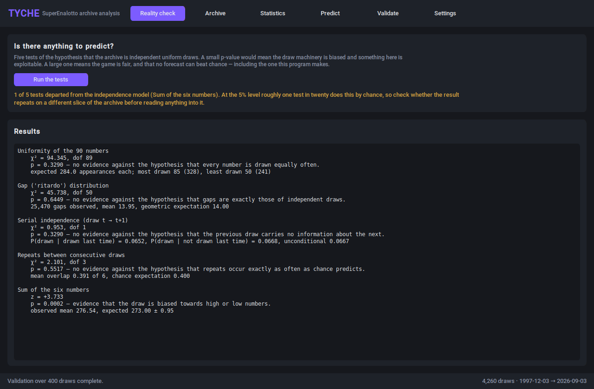
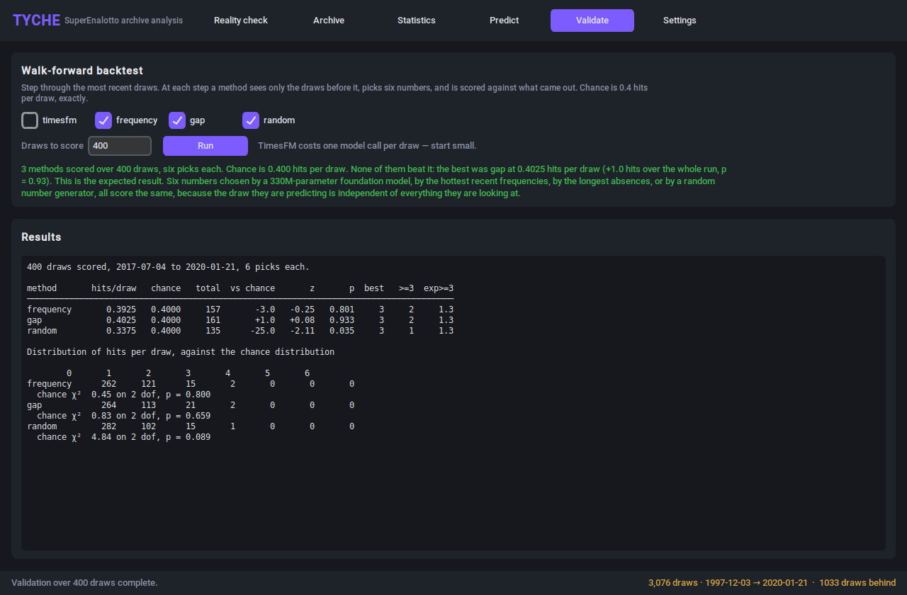
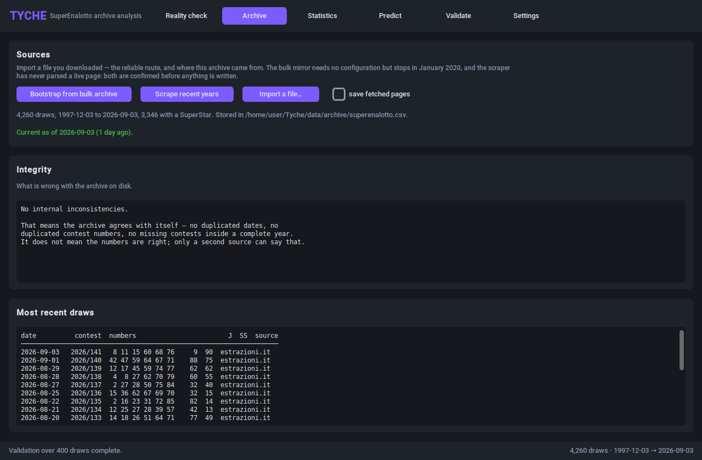

# Tyche

**SuperEnalotto archive analysis and TimesFM 3.0 forecasting.**

A desktop application that downloads the full SuperEnalotto draw history from
December 1997, tests it for exploitable structure, hands it to Google's
TimesFM 3.0 time-series foundation model, and measures — honestly — what the
resulting predictions are worth.

The short version of that measurement: **nothing**. The draws are independent,
the tests say so, and every method in the program scores 0.4 hits out of six,
which is exactly chance. Tyche is built to demonstrate that carefully rather
than to assert it.



---

## What it does

| Tab | What it is for |
|---|---|
| **Reality check** | Five hypothesis tests of the claim that the archive is independent uniform draws. This is the first tab because it is the finding. |
| **Archive** | Download, scrape or import the draw history, and see what is wrong with it. |
| **Statistics** | Frequency, gap (*ritardo*), band and pair tables — each with the value chance would produce, in the same row. |
| **Predict** | Six numbers, from TimesFM 3.0 or from three baselines including a random one. |
| **Validate** | Walk-forward backtest of every method against the last *N* draws. |
| **Settings** | Checkpoint, device, context length, source URLs. |



*The Validate tab. Three methods, 400 draws, chance is 0.4000 — and the
purple-on-black balls of the Predict tab look exactly as confident whichever
of them produced them.*

There is also a command line, for the parts worth scripting:

```
python main.py --check                  # the five independence tests
python main.py --validate 500           # walk-forward backtest, baselines only
python main.py --update                 # refresh from estrazioni.it — dry run
python main.py --update --yes           # ...and write it
python main.py --import FILE --yes      # import a file you downloaded
python main.py --forecast timesfm       # six numbers, no window
python main.py --export-sqlite data/tyche.db
```

`--update` and `--import` report what they would change and write nothing
unless `--yes` is given, and they refuse `--yes` outright when the import
would contradict a stored draw. The archive has no undo and one of the two
network sources has never been verified; a cron job that writes whatever it
parsed is the one shape of this feature that can quietly destroy the history.

---

## Install

```
pip install torch --index-url https://download.pytorch.org/whl/cpu   # optional but smaller
pip install -r requirements.txt
python main.py
```

On Debian or Ubuntu, `tkinter` is a separate OS package and must match the
interpreter you run Tyche with:

```
sudo apt install python3-tk
```

The first TimesFM forecast downloads roughly 1.3 GB of weights from Hugging
Face. Everything except the Predict tab's TimesFM option works without them.

---

## Where the data comes from

Three sources, none of which is both current and verified:

- **estrazioni.it** — the whole archive in one request: **4,260 draws from
  3 December 1997 to the last one**, labelled header, zero integrity issues.
  This is where Tyche's archive comes from and what `--update` tries first.
  Its download URL is inferred rather than documented, so CI checks it and the
  import is always confirmed before anything is written.
- **Manual import** — any CSV, TXT or TSV you downloaded yourself, including
  that same export. The importer reads Tyche's own format, any file with a
  labelled header, the twelve-column bulk format, and as a last resort any
  file with a date and six numbers per line. It cannot break and needs no
  network.
- **Bulk archive** — one request, the whole history, no header. Useful as a
  bootstrap and **it stops in January 2020**: the mirror's own response says
  `last-modified: 24 Jan 2020`. It is also wrong in places — see below.
- **Per-year scrape** — the source that would keep the archive current
  without a manual download. Its URLs were four guesses made from an
  environment that could not reach any of the hosts, and all four missed. One
  has since been corrected from evidence; the rest are still guesses. Check
  what it imports.

The Archive tab shows an **integrity report** next to the draw list, because
the bulk mirror is wrong in a way no per-row check can see: the first nine
draws of 1999 are labelled 1998, which gives nine duplicated contest numbers
and two pairs of different draws sharing a date. Tyche detects and repairs
that on import, from evidence rather than a hardcoded list — see
`core/archive.py::repair_year_offset`.

Two consequences of having one source that is trustworthy but manual and one
that is automatic but unverified:

- **Imports are supervised.** Before anything is written, Tyche dry-runs the
  merge and shows what it would change: rows added, rows that *contradict* a
  stored draw, and any integrity error the merge would introduce. A clean
  import from a trusted source goes straight through; anything from the
  scraper is always confirmed, because a confident-looking mis-parse is
  precisely what an untested parser produces. There is also a "save fetched
  pages" switch — the parser cannot be fixed from a description of what went
  wrong, only from the page that went wrong.
- **Staleness is on screen, not in the documentation.** The footer and the
  Archive tab report how far behind the archive is, in draws, measured
  against the archive's own cadence rather than a hardcoded schedule. Boot-
  strapping from the bulk mirror today reads *"roughly 1033 draws missing"*,
  which is the honest description of what you have.



---

## What the tests actually found

Run against **4,260 draws, 3 December 1997 to 3 September 2026**.

| Test | Result |
|---|---|
| Uniformity of the 90 numbers | χ² = 94.3 on 89 dof, p = 0.33 — no bias |
| Gap (*ritardo*) distribution | χ² = 45.7 on 50 dof, p = 0.64 — gaps are geometric, nothing is ever "due" |
| Serial independence, draw t → t+1 | χ² = 0.95, p = 0.33 — the last draw tells you nothing |
| Repeats between consecutive draws | χ² = 2.10 on 3 dof, p = 0.55 — mean overlap 0.391 against 0.400 expected |
| Sum of the six numbers | z = +3.73, **p = 0.0002** — see below |

Four of five are exactly what a fair game produces. The fifth is not, and it
is the one real finding here — but not the finding it first appeared to be.

**The mean sum of the six numbers is 276.5 against an expected 273.0.** It was
first measured on a different archive entirely, and the obvious explanation
was that the file was wrong. It is not: the effect reproduces on a second,
independent source. What it does instead is *fade*.

| Period | Draws | Mean sum |
|---|---|---|
| 1997–1999 | 217 | 282.3 |
| 2000s | 1,287 | 278.5 |
| 2010s | 1,565 | 276.2 |
| 2020s | 1,191 | **273.8** |

Expected: 273.0. On the last 1,191 draws the test finds nothing at all —
z = +0.42, and the correlation between a number and how often it is drawn
falls from +0.37 over the whole archive to +0.05. Something was pulling the
draw towards high numbers, it got steadily weaker for twenty-five years, and
for the last six there has been nothing to see. Which is roughly the shape you
would expect if it were ever physical.

Two things it is not. It is not a reason to play high numbers: the tilt is
gone, and even at its strongest it was under 2% per number against a prize
fund that keeps a fixed minority share of every euro staked. And it is not
established: it is one statistic on two sources that may share an ancestor.

The walk-forward backtest settles the practical question. The last 1,000
draws, six picks each:

| Method | Hits per draw | Against chance | p |
|---|---|---|---|
| random | 0.3790 | −21.0 | 0.26 |
| frequency ("hot") | 0.3930 | −7.0 | 0.71 |
| gap (*ritardo*) | 0.3900 | −10.0 | 0.59 |

Chance is 0.4000. Nothing beats it, including the 330-million-parameter model.

---

## Odds, which no method changes

Exact combinatorics on a 90-number wheel, six drawn:

| Category | One in |
|---|---|
| 6 | 622,614,630 |
| 5+1 | 103,769,105 |
| 5 | 1,250,230 |
| 4 | 11,907 |
| 3 | 327 |

These hold whatever numbers are played. Prizes are pari-mutuel — a share of
the stakes rather than a fixed payout — so the operator keeps a fixed cut and
the expected return on a line is below its price, always.

---

## Querying the archive

The archive is a CSV because at 4,260 rows that is the right answer: 238 KB,
80 ms to load, and it greps, diffs and opens in a spreadsheet. SQLite reads it
in 7 ms, which is eleven times faster and saves 73 milliseconds once per
launch, against a file a third larger — for comparison, building the feature
matrices costs 63 ms.

So SQL gets an export rather than the storage layer:

```
python main.py --export-sqlite data/tyche.db
```

Three tables: `draws` (one row per draw, with the sum precomputed), `picks`
(one row per number per draw, indexed — this is what makes "how often did 37
come up in 2024" a `GROUP BY`), and `number_stats` (the frequency table, with
each count's expectation beside it). The database is a disposable snapshot;
nothing in Tyche reads it back.

---

## How TimesFM is used

`core/features.py` turns the archive into a `(90, T)` matrix: one series per
number, one column per draw. `core/forecaster.py` hands all ninety to TimesFM
3.0 and asks for the next value of each.

Two details that are easy to get wrong:

- **It uses `TimesFM3Evaluator`, not `TimesFM3Forecaster`.** The model attends
  over at most 32 variates per forward pass. The Evaluator is the subclass
  that chunks a wider input and reassembles it, so ninety numbers become three
  groups of thirty-two. It is *not* one joint context over all ninety, and
  anyone repeating the "TimesFM 3.0 is multivariate so it models them all
  together" line should know that.
- **The series it is fed matters.** The raw 0/1 presence series has a mean of
  6/90 and no gradient; the rolling-frequency series is smooth enough to
  forecast and invents momentum that is not there, because a moving average of
  white noise looks like a trend. Tyche defaults to frequency and offers
  presence, which forecasts to a flat line — worth seeing once.

And what it does with them, from a real run on a machine that could download
the weights:

```
frequency  top six: 15 32 37 52 66 90    score spread 0.100000
timesfm    top six: 32 37 52 66 79 90    score spread 0.099857
```

Five of the six numbers are the same and the spread matches the input series'
own to four decimals. Given ninety series with no signal in them, the model
predicts approximately the last value of each — which is exactly right, and
which makes its ranking a copy of the hot-numbers baseline. That is the whole
result in two lines.

---

## Licensing

Tyche is a **private project**, all rights reserved. See `LICENSE`.

The TimesFM split matters if that ever changes: the `timesfm` package code is
Apache-2.0, but the `google/timesfm-3.0-pytorch` **weights** are under
`timesfm-non-commercial-license-v1.0` and are restricted to non-commercial,
non-production use. Weights up to 2.5 remain Apache-2.0 — but 2.5 has no
native multivariate forecasting and is not a drop-in replacement for what
`core/forecaster.py` does.

---

## Running the tests

```
python -m pytest tests/ -q                                    # 111 core tests
TYCHE_REQUIRE_GUI=1 xvfb-run -a python -m pytest tests/ -q     # 128, GUI included
python -m ruff check .
```

The GUI suite skips itself when there is no display or no tkinter, and a run
reporting "111 passed, 1 skipped" means the entire interface went untested.
`TYCHE_REQUIRE_GUI=1` turns that skip into a failure; set it whenever you
intend to have verified a GUI change. CI sets it.

The README screenshots are committed files and go stale silently. After any
change to the interface:

```
SHOTDIR=docs/screenshots xvfb-run -a python docs/generate_screenshots.py
```

---

## Releases

Tagging a version publishes one. `.github/workflows/release.yml` checks out
the tag, lints, runs the whole suite with the interface included, checks that
the version the program reports matches the tag, and only then creates the
release — with notes composed from `CHANGELOG.md` rather than from the commit
log. There are no binaries to download: Tyche runs from source, and freezing
it would mean shipping a few hundred megabytes of PyTorch per platform.

---

*Tyche is named for the Greek goddess of chance. She is not on anyone's side.*
